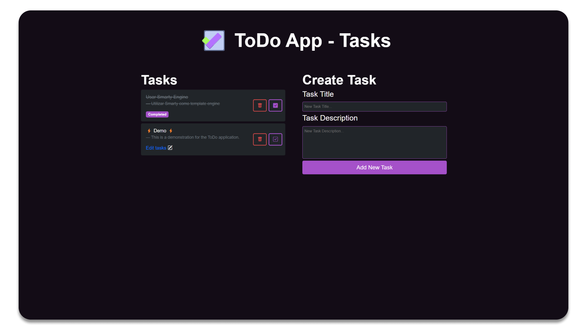

# ToDo Application

<p align="center">
    
</p>

A web application made with **[PHP](https://www.php.net/)** and **[Smarty](https://www.smarty.net/)** as template engine, **[MySQL](https://www.mysql.com/)** for the database and **[Apache](https://www.apache.org/)** as the server.



Index:

1. [Backend](#backend)

    - [Structure](#db-structure)

    - [Handler](#db-handler)

    - [Routing](#routing)

2. [Frontend](#frontend)

    - [Templates](#frontend-layout)

    - [Styles](#frontend-style)

## Backend

I used **[MySQL](https://www.mysql.com/)**.

### Structure

| **Field**        | **Type**     | **Null**    | **Key**   | **Default**   | **Extra**      |
|------------------|--------------|-------------|-----------|---------------|----------------|
| task_id          | int(11)      | NO          | PRIMARY   | NULL          | auto_increment |
| task_title       | varchar(30)  | NO          |           | NULL          |                |
| task_description | varchar(200) | YES         |           | NULL          |                |
| task_done        | tinyint(4)   | NO          |           | 0             |                |

### Handler

The handler is a class that handles the database connection and the queries.

Using the **[PDO](https://www.php.net/manual/en/class.pdo.php)** class, the handler is able to execute queries and fetch the results.

```php

function get_connection(): PDO {
    try {
            $db = new PDO('mysql:host=' . ConfigApp::_DB_HOST . ';dbname=' . ConfigApp::_DB_NAME, ConfigApp::_DB_USER, ConfigApp::_DB_PASS);

            return $db;
    } catch (PDOException $e) {
            $db = null;
            $error = new ToDoError('Fallo al conectar a la base de datos', 500, $e);
            $error->show_error();
            throw $e;
    }
}

```

See more in the **[dbh.php](public/dbh.php)** file.

### Routing

I used **[.htaccess](public/.htaccess)** to redirect the requests to the **[route.php](public/route.php)** file.

```apache

<IfModule mod_rewrite.c>
    
    # Rewrite rules for the application
    # Turns on the RewriteEngine
    RewriteEngine On
    # If the request is for a file, ignores it
    # If the request is for a directory, ignores it
    RewriteCond %{REQUEST_FILENAME} -f [OR]  
    RewriteCond %{REQUEST_FILENAME} -l

    RewriteRule ^[css|img|js|json].*$ - [L]
    # Ignores hidden files
    # Reroutes all requests to route.php with an action
    RewriteRule ^(.*)$ route.php?action=$1 [QSA,L]

</IfModule>

```

In the **[route.php](public/route.php)** file, I used an url parser to redirect the requests to the correct controller and method.

```php

function url_parse(string $url): array {
    $url_data = explode('/', $url);
    $data_array[ConfigApp::$ACTION] = $url_data[0];
    $data_array[ConfigApp::$PARAMS] = isset($url_data[1]) ? array_slice($url_data, 1) : null;

    return $data_array;
}

```

See more in the **[route.php](public/route.php)** file.

## Frontend

I went for a desing using **[Bootstrap 5](https://getbootstrap.com/)** as a framework and a little touch of my own colorscheme [styles.css](public/css/styles.css).

I also used **[Smarty](https://www.smarty.net/)** as template engine.

### Templates

```tree

├───📂 templates
        - 📝 delete_modal.tpl
        - 📝 edit_task.tpl
        - 📝 error.tpl
        - 📝 footer.tpl
        - 📝 header.tpl
        - 📝 task.tpl
        - 📝 task_list.tpl

```

### Styles

Colorscheme for a dark theme purple style.

```css

html {
    --bg-red: #c64646 !important;
    --bg-red-darker: #b43737 !important;
    --bg-purple: #a551c9 !important;
    --bg-purple-darker: #9046b0 !important;
    --bs-body-font-family: 'Roboto', sans-serif !important;
}

.dark {
    background-color: #130c16;
    color: #fff;
}

```

See more in the **[styles.css](public/css/styles.css)** file.
